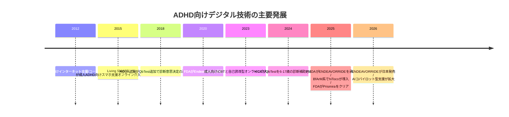
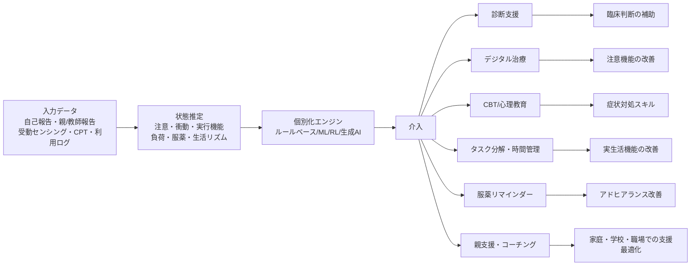

# ADHD改善に向けたAIとソフトウェア活用の深層調査報告

## エグゼクティブサマリー

本報告は、ADHDの**小児・青年・成人**を対象に、AIおよびソフトウェア／アプリの活用可能性を、診断支援、症状モニタリング、個別化介入、デジタル治療、認知トレーニング、注意・衝動コントロール、服薬アドヒアランス、コーチング、学校・職場配慮、保護者・介護者支援まで含めて横断的に評価したものである。ADHDは不注意、多動性、衝動性を中核症状とする神経発達症で、児童期に始まり青年期・成人期まで持続しうる。臨床像は年齢で変化しやすく、成人では外在化した多動よりも不注意や実行機能障害の形で困難が表れやすい。したがって、デジタル技術の価値は「万能な単独治療」ではなく、**診療・教育・就労支援の隙間を埋める補助レイヤー**として評価するのが妥当である。 citeturn24search0turn24search1turn24search11turn5search7

現時点で最もエビデンスが強い領域は、**ゲーム型デジタル治療**と**一部のデジタル親支援介入**である。米国では EndeavorRx がFDAのDe Novo承認を受け、日本ではそのローカライズ版 ENDEAVORRIDE が2025年にPMDA承認、2026年に発売された。さらに成人向けには EndeavorOTC と Prismira/LumosityRx がFDA経路で市場化され、いずれも主に**TOVA等のデジタル注意指標**で改善を示している。一方で、これらは行動症状や機能障害の全面的改善を保証するものではなく、**不注意・選択的注意の改善が中心**である点、また日本のENDEAVORRIDEは**多動／衝動優勢型を適応対象から除外**している点が重要である。 citeturn25view0turn4view0turn4view1turn6search20turn26search2turn26search4

診断支援では、QbTest/QbCheck が最も制度化に近く、英国NICEは2024年に**6〜17歳**の標準臨床評価に追加して用いる選択肢として QbTest を推奨した。しかし同時に、**単独診断は不可**であり、成人ではなお研究段階とされた。系統的レビューでも、QbTest は診療フロー短縮や客観化に利点がある一方、臨床現場で ADHD と非ADHD症例を十分な精度で峻別するには限界があると結論づけられている。機械学習・スマホCPT・顔／動作センサを使う研究は増えているが、**臨床実装はまだ限定的**である。 citeturn5search3turn5search15turn5search4turn32search14turn32search1turn32search12

成人向けの自己管理アプリやAI支援ツールは、**実用性は高いが医療エビデンスは薄い**。Inflow のようなCBT系アプリは feasibility 研究と最近のRCTで有望さを示し、Tiimo や Goblin Tools は実行機能補助やタスク分解に強いが、現時点では医療機器ではなく、臨床アウトカムに対する直接エビデンスは不足している。Shimmer/Indy のようなコーチング統合型AIも、継続率・満足度・個別化の点で魅力がある一方、公開された厳密RCTはまだ乏しい。したがって、**“効果がありそう” と “医学的に有効が確立している” を分けて運用する**必要がある。 citeturn8search6turn14search0turn17search0turn15search0turn15search1turn19search2turn30search3

政策・実装上の要点は三つある。第一に、AIは**診断の代行ではなく意思決定支援**として設計すべきである。第二に、個人情報保護、とくに**未成年者データ・行動データ・生成AI入力データ**の取り扱いを強固にする必要がある。第三に、学校・職場ではアプリそのものよりも、**配慮設計・通知設計・負荷設計・導入ガバナンス**が成果を左右する。本報告の結論として、2026年時点の最適戦略は、**規制承認済みの治療用プログラム医療機器をコアに、CBT系アプリ、親支援、服薬リマインダー、実行機能補助ツールを個別ニーズに合わせて重ねる多層モデル**である。 citeturn37view1turn38view0turn37view0turn37view2turn33search2turn33search7

## 定義と調査範囲

ADHDは、持続的な**不注意**および／または**多動性・衝動性**によって、発達や機能に臨床的な支障を来す神経発達症である。NIMHは、不注意優勢、多動性・衝動性優勢、混合型という三つの主要な呈示を示している。日本の患者向け公的・準公的情報でも、不注意・多動性・衝動性の三徴を中核に、児童期から存在しうる特性として説明されている。 citeturn24search0turn24search1turn24search5turn24search11

年齢層は、本依頼に明示がないため**小児、青年、成人のすべて**を対象とした。臨床的には、児童では落ち着きのなさや教室内行動、青年では学業・睡眠・デジタルメディア使用との相互作用、成人では仕事・家事・時間管理・対人関係・服薬継続の問題が前景化しやすい。成人では多動の見え方が変わり、不注意や先延ばし、感情調整の困難、職場適応の問題として表出しやすい。 citeturn24search10turn24search11turn33search5turn34search10

本報告の「AI」とは、機械学習、ルールベース最適化、強化学習を含む個別化アルゴリズム、生成AI、受動センシング解析、適応型デジタル治療エンジンまでを含む。一方、「ソフトウェア／アプリ」は、医療機器プログラム、非医療ウェルネスアプリ、学校・仕事向け補助ツール、服薬支援アプリ、オンラインCBTプログラム、コーチング・親支援アプリを含む。つまり本報告は、**狭義のAI医療機器だけでなく、ADHDの実生活機能を改善しうる広義のデジタル支援技術**を扱う。研究開発国・対象国は指定されていないため、**米国、英国・EU、日本**の公式規制情報を優先し、必要に応じて国際的な原著論文と試験登録情報を併用した。 citeturn4view1turn5search15turn25view0turn26search2

評価軸は、**作用機序、代表的プロダクト、エビデンス水準、効果指標、限界、安全性、倫理・プライバシー、規制状況**で統一した。ここでの「エビデンス」は、RCTを最上位に、観察研究、実装研究、症例研究、公開されている規制審査資料、試験登録情報を下位に置いて総合判定している。なお、価格・言語・アプリ機能・プライバシーポリシーは変動しうるため、**2026年7月16日までに確認できた公開情報**に基づく。 citeturn5search4turn25view0turn37view0turn37view1turn38view0

## エビデンス地図と技術発展

2010年代前半から2020年代半ばにかけて、ADHD向けデジタル技術は、**オンライン心理教育・支援**から**客観的デジタル評価**、さらに**規制承認済みデジタル治療**へと発展した。初期の生活支援・親支援・オンラインCBT研究を経て、QbTest のような客観評価ツールが臨床導入され、2020年以降は EndeavorRx、ENDEAVORRIDE、Prismira/LumosityRx のような医療機器プログラムが登場した。並行して、2023年以降は成人向けiCBTや自己管理アプリ、2025年以降はAIコパイロット型の実行機能補助やデジタル親支援が目立つようになっている。 citeturn9search5turn12search1turn5search6turn25view0turn4view1turn26search4turn14search0turn35search1



以下の図は、本報告のエビデンスを**相対的な強さ**で整理したものである。ここでいう強さは、規制審査資料、RCT、系統的レビューの蓄積、臨床的アウトカムの質を総合した**筆者の統合評価**である。デジタル治療と親支援は相対的に強く、学校・職場向け配慮アプリ、生成AIコパイロット、症状モニタリングは有望だが、まだ臨床確証が弱い。 citeturn25view0turn4view0turn10view0turn31search24turn32search14turn8search10

```mermaid
xychart-beta
    title "ユースケース別の相対的エビデンス強度"
    x-axis [デジタル治療, 診断支援, 親支援, 成人CBT系, 認知訓練, 症状モニタリング, 服薬支援, コーチング, 学校職場補助]
    y-axis "強度" 0 --> 5
    bar [5, 4, 4, 3, 2, 2, 1, 1, 1]
```

ADHD向けAI介入の経路は、典型的には**データ収集 → 状態推定 → 個別化 → 行動変容支援 → 結果評価**という流れを取る。重要なのは、どこであっても**臨床家・教師・本人・保護者の判断を置き換えない**こと、また「注意力検査の改善」が直ちに「学校成績」「職場機能」「家庭内ストレス」の改善を意味しないことである。規制当局も、Endeavor系やPrismira系を**既存治療を含む包括的プログラムの一部**として位置づけている。 citeturn25view0turn26search2turn4view0turn5search7



## AIユースケースの分析

下表は、依頼で指定された十のユースケースについて、作用機序、代表例、エビデンス、指標、限界、安全性、規制状況を一望できるように整理したものである。表のあとに、実務上重要な論点を補足する。なお、**“AI” が中核のものと、AI成分が限定的だがソフトウェアとして有望なもの**を意図的に混ぜている。これは、ADHD支援では実生活上の有用性が純粋なAI高度性より重要だからである。 citeturn8search10turn9search12

| ユースケース | 主な作用機序 | 代表例 | エビデンス水準 | 主要な有効性指標 | 限界 | 安全・倫理・プライバシー | 規制状況 |
|---|---|---|---|---|---|---|---|
| 診断支援 | CPT、動作追跡、規範データ比較、ML分類 | QbTest/QbCheck、スマホCPT＋顔/動作センサ研究 citeturn18search15turn18search5turn32search1 | **中等度**。AQUA RCT、実装研究、系統的レビューあり。ただし単独診断能は不十分。 citeturn5search6turn5search4turn32search14 | 6か月以内の診断意思決定率、受診回数短縮、客観尺度の追加情報 citeturn5search4turn5search8 | 偽陽性/偽陰性、複雑症例・成人で一般化しにくい citeturn5search3turn32search14 | バイアス、過度の自動化、未成年データの扱い | QbTestはNICEが6–17歳で補助的使用を推奨。VendorはFDA/MDR/CE-clearedを公表。成人はNICEで研究扱い。 citeturn5search15turn5search3turn5search17 |
| 症状モニタリング | EMA、受動センシング、アクチグラフィ、継続自己報告 | mCASS、デジタルマーカー研究、Qbtech treatment monitoring、FOCUS ADHD試験 citeturn8search18turn8search0turn32search5turn7search12 | **低〜中等度**。主に観察研究・概念実証・妥当性研究。RCTは少ない。 citeturn8search9turn8search13turn7search9 | 症状変動予測、服薬開始後の遠隔追跡、活動・睡眠指標との相関 citeturn8search13turn8search2 | データ欠測、スマホ利用習慣依存、デジタルデバイド | 行動ログは機微情報で再識別リスクが高い | 大半は研究段階。医療機器承認は限定的。 citeturn7search2turn7search12 |
| 個別化介入 | 適応ゲーム難度、アルゴリズム最適化、JITAI、生成AIによる足場かけ | Endeavor系、Prismira/LumosityRx、Sincrolab Adults研究、Tiimo/Goblin/Indy citeturn25view0turn26search3turn31search17turn36search0turn37view3turn39search17 | **中等度**。治療用SaaMDでは高いが、生成AI系生活支援は低い。 citeturn25view0turn26search2turn14search0 | TOVA、CGI-I、タスク開始・継続、主観的負荷軽減 citeturn25view0turn26search2turn36search0 | 個別化ロジックが不透明、効果の再現性がプロダクト間で大きい | ブラックボックス、幻覚、過剰依存 | 医療機器とウェルネスアプリが混在。承認状況はプロダクト依存。 |
| デジタル治療 | 選択刺激管理、適応型ゲーム課題、神経認知回路への反復負荷 | EndeavorRx、ENDEAVORRIDE、EndeavorOTC、Prismira/LumosityRx citeturn25view0turn4view1turn6search20turn26search2turn26search4 | **高い**。規制審査＋RCTあり。もっとも確立。 citeturn25view0turn4view0turn26search2 | TOVA改善、CGI-I、AAQoL、ADHD-RSの一部改善、薬物移行抑制示唆 citeturn25view0turn4view0 | 行動症状・機能全般への波及は限定的、不注意に寄る | ゲーム依存、スクリーンタイム、適応外使用 | FDA: EndeavorRx/EndeavorOTC/Prismira。PMDA: ENDEAVORRIDE。 citeturn25view0turn4view1turn26search4 |
| 認知トレーニング | WM・抑制・注意トレーニング、適応難度 | Cogmed、AttenFocus、AI-based Sincrolab Adults研究 citeturn31search4turn31search18turn31search17 | **低〜中等度**。近位転移はあるが、盲検下症状改善は限定的。 citeturn31search24turn31search6turn31search5 | 作業記憶・訓練課題成績、注意指標、一部症状尺度 citeturn31search18turn31search4 | 遠位転移が弱い、離脱、商業的誇張のリスク | 誇大広告、利用者の金銭負担 | 多くは非医療機器。AI版も多くは研究段階。 |
| 注意・衝動管理 | タスク分解、視覚スケジューリング、タイマー、環境刺激制御 | Tiimo、Goblin Tools、Brain.fm等の集中支援、Inflowの衝動性モジュール citeturn36search0turn37view3turn21search10turn17search5 | **低い**。使いやすさは高いが、ADHD臨床アウトカムのRCTは限られる。 citeturn14search0turn8search10 | タスク着手率、主観的集中、日課維持 | 実装依存が大きい、一般生産性アプリとの差別化が難しい | 入力テキストの機微性、生成AI誤出力 | 通常はウェルネス／生産性アプリで医療承認なし。 |
| 服薬アドヒアランス | リマインダー、家族通知、服薬記録、再処方通知 | Medisafe、FOCUS ADHD試験、スマホ薬剤リマインダー研究 citeturn39search18turn37view2turn7search12turn29search11 | **ADHD特異的には低い**。一般慢性疾患では中等度。 citeturn29search11turn29search5turn29search10 | 服薬率、継続率、欠薬通知、家族支援 | ADHDでの専用RCTが少ない | 服薬データは高度機微情報。第三者共有の管理が必要。 | Medisafeは医療機器ではなく一般アプリ。公開資料ではHIPAA/GDPR/ISO対応を強調。 citeturn22search5turn37view2 |
| コーチング | 目標設定、アカウンタビリティ、生活スキル、AI補助的足場かけ | Shimmer、Indy、インターネット支援・コーチング研究 citeturn18search3turn39search17turn9search5turn9search11 | **低い**。前向き研究や質的研究はあるが、厳密RCTは不足。 citeturn30search0turn30search3turn30search15 | 継続率、自己効力感、感じる混乱の減少 | 効果の標準化が難しい、コーチ資格のばらつき | 生成AIが助言品質を左右しうる | 公開資料で医療機器承認表示は確認できず、サービス型が中心。 citeturn37view1turn39search0 |
| 学校・職場配慮 | ICT支援、視覚化、通知最適化、静かな作業環境、タスク構造化 | Tiimo、Goblin Tools、学校ICT支援ガイド、職場配慮の制度 citeturn36search0turn37view3turn33search7turn33search2turn33search3 | **低い**。制度・実装研究中心。 | IEP/504、課題完了、授業参加、職務遂行の主観改善 citeturn33search2turn33search14 | 技術より配慮設計が重要、導入条件差が大きい | 学校・職場での監視化の懸念 | 多くは非医療機器。教育・労働制度との接続が重要。 |
| 保護者・介護者支援 | デジタル親訓練、CBT・行動管理、宿題・ルーチン・ストレス対処 | hiToco、STEPS、Treks、親向けアプリ研究 citeturn35search1turn35search6turn9search16turn9search0 | **中等度**。hiTocoのRCTは有望。 | 外在化問題、ADHD/ODD症状、機能障害、親のストレス citeturn10view0 | 言語・文化依存、家族背景で効果差 | 子どもの情報と親情報が同時に蓄積される | hiToco はドイツでDiGA・処方/償還対象。日本・米国で同等承認は未確認。 citeturn35search1turn35search6 |

実務上もっとも重要なのは、**診断支援**と**デジタル治療**を混同しないことである。QbTestは客観指標を与えるが、NICEも単独診断を認めていない。これに対し Endeavor系や Prismira は治療機器として承認されているが、それでも薬物療法、心理社会的治療、教育的介入と併用されるべきものとして位置づけられている。つまり、**診断の客観化**と**症状改善の介入**は別のレイヤーである。 citeturn5search3turn5search7turn25view0turn4view0

また、**生成AIの急速な普及が、エビデンスと市場の乖離を拡大している**。Tiimo、Goblin Tools、Indy などは実行機能補助として合理的で、多くのユーザーに役立つ可能性が高いが、医療機器ではなく、自己申告の混乱低減や生産性向上が中心である。これは価値が低いという意味ではなく、**臨床アウトカムの確証がまだない**という意味である。臨床家や学校が導入する際には、自己管理補助ツールとして扱い、症状診断や治療効果判定の代替にしない運用が望ましい。 citeturn36search0turn37view3turn39search17turn14search0

## 主要アプリとソフトウェアの比較

以下は、現時点で比較的参照価値の高い製品群を、**医療機器、準医療的支援、生活実装支援**をまたいで比較した表である。価格は地域差やサブスクリプション条件が大きいため、できる限り**「無料版あり」「処方」「公開価格未公表」**の形で表記した。 citeturn6search20turn17search2turn15search1turn39search18

| 名称 | 開発元 | 主対象 | プラットフォーム | AI成分 | エビデンス | 価格 | 言語 | アクセシビリティ | データ取扱い |
|---|---|---|---|---|---|---|---|---|---|
| ENDEAVORRIDE | 塩野義製薬 / Akili技術 | 小児ADHD 6–17歳、日本適応は小児期ADHDで多動／衝動優勢型除外 | スマホ・タブレット | 適応型ゲームエンジン（SSME） citeturn6search20turn4view0 | PMDA審査、国内外試験あり。治療補助として最上位。 citeturn4view0turn4view1 | 処方医療機器。患者向け公開価格は一般公開限定的 | 日本語中心 citeturn6search20 | 医療機器として運用。公開情報では一般アプリのようなストア記載は限定的 | PMDA承認済みSaMD。医療機関連携前提。 citeturn4view1 |
| EndeavorRx | Akili | 小児ADHD 8–12歳中心 | iOS等 | 適応型デジタル治療 | FDA承認済み。注意機能改善のRCTあり。 citeturn25view0 | 処方 | 英語中心 | 公開情報の範囲では医療機器運用 | 医療機器として管理 |
| EndeavorOTC | Akili | 成人ADHD 18歳以上 | iOS/Android | 適応型デジタル治療 | FDA 510(k)。注意機能のデジタル指標改善。行動症状改善は限定的。 citeturn25view0 | OTC、公開価格変動 | 英語中心 | 一般デジタル治療UI | 医療機器として管理 |
| Prismira / LumosityRx | Lumos Labs Medical | 成人ADHD 22–55歳 | モバイル、自宅利用 | 適応ゲーム、個別化トレーニング | FDA 510(k)でTOVA、CGI-I、AAQoL改善。SAEなし。 citeturn26search2turn26search3 | 処方。公開価格未公表、待機リスト運用あり citeturn26search1 | 英語中心 | 標準モバイルUI | 医療機器として運用 |
| QbTest / QbCheck | Qbtech | 小児〜成人、ただしNICE推奨は6–17歳 | クリニック内／遠隔Web | 規範比較、客観測定、解析レポート | 診断支援として中等度。AQUA、NICE、レビューあり。 citeturn5search15turn32search14 | B2Bサブスク | 言語非依存設計を強調 citeturn18search7turn18search13 | 言語依存が低く、視覚レポート | 詳細は医療機関契約依存。VendorはMDR/CE/FDAを公表。 citeturn5search17 |
| Inflow | Get Inflow Ltd. | 主に成人 | iOS/Android | 個別化学習、コンテンツ最適化、コミュニティ | feasibility研究＋成人RCT。医療機器ではない。 citeturn8search6turn14search0turn17search0 | 年額199ドルまたは月額47.99ドル、7日試用あり citeturn17search2 | 英語中心 citeturn39search20 | 公開ストア情報では機能記載はあるが明示的アクセシビリティ情報は限定的 | 個人情報・利用情報・Cookie等を収集。共有/保護方針あり。 citeturn37view0 |
| Shimmer / Indy | Shimmer, Inc. | 主に成人 | モバイル・Web | AIコパイロット、第三者生成AI利用、コーチング統合 | コーチング自体のRCTは乏しい。サービスの個別化は高い。 citeturn37view1turn30search3 | App Store表示では Essentials 139.99ドル、Standard 229.99ドル等の課金あり citeturn15search6 | 英語 | App Storeでは明示アクセシビリティ表示なし citeturn39search2 | 反省記録、目標、会話、録音オプトアウト等。OpenAI等の外部AI利用を明示。 citeturn37view1 |
| Tiimo | Tiimo A/S | ADHD・自閉スペクトラム・実行機能困難を含む広い層 | iOS/Android/Web | AI task breakdown、優先順位支援 | 臨床RCTは乏しいが、実行機能補助として高い実装性。 citeturn36search0turn15search1 | 無料版あり、7日試用、Pro課金 citeturn15search1turn36search0 | 日本語含む23言語程度 citeturn23search2turn23search9 | VoiceOver、Voice Control、Larger Text、Dark Interface対応 citeturn23search2 | GDPR下で最小限収集、第三者委託、販売しない、解約後2年保持。 citeturn38view0turn38view2 |
| Medisafe | Medisafe | 年齢横断、ADHD特化ではない | iOS/Android/Web | 行動ベース通知・家族連携・相互作用警告 | ADHD特化エビデンスは弱いが、一般アドヒアランス支援として実績大。 citeturn39search18turn29search11 | 無料版あり、Premium課金 citeturn15search5turn39search7 | 多言語展開だが国別差あり | Lock Screen widget等あり citeturn39search14 | 個人情報は売却しない・広告利用しないと明示。HealthKit等連携、AWS等委託。 citeturn37view2turn22search5 |
| hiToco | medigital / MEDICE系 | 4–11歳の子どもの保護者 | スマホ・タブレット | 個別訓練プラン、デジタル親訓練 | RCTで有望。親支援では強い。 citeturn10view0turn35search6 | ドイツでは処方・償還、患者自己負担なし citeturn35search6turn35search1 | ドイツ語中心 citeturn35search8 | 一般親向け設計 | BfArM審査を通るDiGAとして、データ保護・セキュリティ要件ありと説明。 citeturn35search6 |
| Goblin Tools | Bram De Buyser / Arcology | 神経多様性当事者を含む広い層 | Web / Android / iOS | バックエンド生成AIでタスク分解・文体変換 | 臨床試験はほぼない。生活補助として有用性高い可能性。 citeturn37view3turn19search0 | Web無料、モバイル低価格 citeturn37view3turn19search0 | 公式説明では多言語対応が拡大中。App Store断面では英語中心表記もあるため要確認。 citeturn39search4turn39search8 | App Storeでは明示アクセシビリティ情報なし citeturn39search8 | 一般目的AIで真実保証なしと明記。出力は推測扱いと注意喚起。 citeturn37view3 |

この比較表から分かるのは、**規制承認の強さと生活実装のしやすさが一致しない**という点である。ENDEAVORRIDE、EndeavorRx、Prismira は規制・試験の面では強いが、適応年齢や対象症状が狭い。逆に Tiimo、Goblin Tools、Inflow は日常生活への埋め込みが容易だが、医療効果の厳密性は弱い。したがって、実装戦略としては、**医療機器で治療コアを担保し、生活支援アプリで周辺機能を補完する組み合わせ**が合理的である。 citeturn25view0turn4view1turn26search2turn36search0turn37view3turn17search0

特に日本での実装を考えると、2026年時点で公開情報から確認できるADHD向けのPMDA承認プログラム医療機器は ENDEAVORRIDE が中核であり、日本語対応や国内流通の点で実装可能性が最も高い。一方、成人向けの承認済みデジタル治療は米国側が先行しており、日本では**成人ADHDデジタル治療に明確な制度ギャップ**がある。 citeturn4view1turn6search20turn26search4

## 重要論文と臨床試験

以下では、政策判断や現場導入に影響が大きい原著・試験を優先して選んだ。レビュー論文は必要最小限に留め、できるだけ**RCT、規制審査資料、登録試験、実装研究**を前面に置いている。 citeturn5search6turn25view0turn10view0

| 文献・試験 | デザイン | 対象 | 主な結果 | 実務上の意味 |
|---|---|---|---|---|
| Hollis et al., 2018, AQUA trial citeturn5search6 | 多施設RCT | 子ども・青年のADHD評価 | QbTest を標準評価に追加すると、診断意思決定のスピード・効率改善を示唆 | 診断支援ツールの代表的原著。**単独診断ではなく、フロー改善**が主眼 |
| NICE DG60, 2024 citeturn5search15turn5search3 | 公式評価ガイダンス | 6–17歳 | QbTest を標準評価に追加する選択肢として推奨。成人は研究利用に留保 | 規制・償還・導入議論で最重要。**年齢による推奨差**が明確 |
| PMDA ENDEAVORRIDE review, 2025 citeturn4view0turn4view1 | 規制審査報告 | 日本の小児ADHD | 有効性と安全性を承認。多動/衝動優勢型は適応除外 | 日本の臨床導入で最重要。**適応の境界条件**を理解する必要 |
| STARS-ADHD / EndeavorRx 系試験、FDA関連資料 citeturn25view0 | RCT＋規制審査 | 小児ADHD | 注意機能のデジタル指標改善。行動症状への波及は限定的 | DTxの効果指標が**TOVA中心**であることを示す |
| Prismira GAMES Study, FDA 510(k) summary, 2025 citeturn25view0turn26search2 | sham対照、多施設RCT | 成人ADHD 22–55歳、n=560 | TOVA ACS差 p=0.0149、CGI-I p=0.0087、AAQoL平均8.7点改善、重篤有害事象なし | 成人ADHD向けSaaMDで最重要。**注意機能は改善するが、症状全般は別問題** |
| Nasri et al., 2023 iCBT RCT citeturn13search1turn13search6turn13search11 | 3群RCT | 成人ADHD n=104 | iCBT も internet-based relaxation も TAU より ASRS 改善。効果は12か月持続 | 成人向けデジタル心理介入は**治療選択肢として現実味が高い** |
| Kenter et al., 2023 self-guided intervention citeturn13search0turn13search5turn13search7 | RCT | 成人ADHD | 自己誘導型インターネット介入の有効性検証。ただしドロップアウト高率 | スケーラブルだが、**継続率が最大課題** |
| Moëll et al., 2015 Living SMART citeturn12search1turn12search8 | RCT | 成人ADHD/閾値下ADHD | ASRS不注意が有意低下、盲検評価で33%が臨床的改善 | スマホを使った生活構造化介入の初期重要研究 |
| Knouse et al., 2022 Inflow feasibility citeturn8search6turn8search26 | open feasibility study | 成人ADHD | 7週間で受容性・実用性を確認 | 市販CBT系アプリの**先行証拠** |
| Antshel et al., 2025 adult CBT-informed app RCT citeturn14search0 | waitlist対照RCT | 成人ADHD n=154 | 8週間のCBT-informed appの効果を報告 | 成人自己管理アプリのエビデンスが**feasibilityからRCTへ移行**していることを示す |
| Döpfner et al., 2025 hiToco RCT citeturn10view0 | pilot RCT | 4–11歳児の保護者と子ども n=65 | 外在化行動の主要評価で d=0.74（12週）、d=0.48（16週） | 親支援アプリは**子どもの症状と家族ストレス双方**に効きうる |
| Bellato et al., 2024 QbTest systematic review/meta-analysis citeturn32search14turn32search2 | SR/MA | 診断支援 | QbTestの臨床的識別力は単独診断には不十分 | 現場での過大評価を防ぐために必読 |
| Westwood et al., 2023 CCT meta-analysis citeturn31search24turn31search0 | MA | ADHD全般 | CCTの臨床・認知・学業アウトカムを統合。近位効果はあるが全般効果は限定 | 認知トレーニングは**期待値調整**が必要 |
| Cibrian et al., 2024 digital assessments mapping review citeturn32search12turn28search17 | mapping review | 児童・青年 | ADHD初期診断と継続モニタリングのデジタル評価を体系化 | 研究開発の空白と過密を俯瞰できる |

ここから読み取れる大局は明快である。**小児の治療用SaaMD、親向けデジタル訓練、成人のiCBT**は、それぞれ別の臨床課題に対して有望であり、相互代替ではなく相補的である。他方で、**認知トレーニングの一般論としての「脳トレ」**や、**AIによるタスク分解・助言**は、まだ臨床試験密度が不足している。したがって、文献の重みづけでは、規制審査・RCT・追跡ありの研究を最重視すべきである。 citeturn25view0turn10view0turn13search1turn31search24

## ギャップと研究アジェンダ

現在の研究には、少なくとも六つの構造的ギャップがある。第一に、**成人ADHD向けの規制承認済みデジタル治療は米国先行で、日本・他地域への外的妥当性が弱い**。第二に、注意指標は改善しても、**学業、就労、家庭機能、事故、欠勤、二次障害**などの現実アウトカムにまで効果が届くかは不明である。第三に、**多動／衝動優勢型、併存症あり、女性、成人初診例、社会経済的困難層**などのデータが薄い。第四に、生成AIを用いたコパイロット型支援の臨床試験がほぼ欠ける。第五に、未成年データ・受動センシングのガバナンス標準が未整備である。第六に、学校・職場での実装研究が弱く、**“効く技術” より “続く運用” の研究が足りない**。 citeturn4view0turn25view0turn30search3turn8search9turn37view1

以下に、優先度つきで研究課題を提案する。各提案では、**問い**だけでなく**推奨デザイン**まで明示した。これは、単なる「今後の課題」ではなく、そのまま研究計画書の骨子に使える水準を意図している。 citeturn31search17turn7search12turn30search6

| 優先度 | 研究課題 | 推奨デザイン | 主要評価項目 |
|---|---|---|---|
| 高 | デジタル治療はTOVA改善を超えて学校・仕事機能を改善するか | プラグマティックRCT、12か月追跡、薬物療法併用層別化 | 学業成績、欠席、遅刻、欠勤、WFIRS、QOL |
| 高 | 成人ADHD向けAIコパイロットはCBTアプリ単独より有効か | 3群RCT（CBT app vs CBT+AI coach vs TAU） | ASRS、作業完了率、離脱率、自己効力感 |
| 高 | 多動/衝動優勢型、併存ASD/不安/抑うつでDTx効果はどう異なるか | 適応型プラットフォーム試験、プレ登録サブグループ解析 | 症状別反応、AE、継続率 |
| 高 | 受動センシングは再発・機能悪化・服薬中断を予測できるか | 前向きコホート＋外部妥当化＋事前定義アラート閾値 | AUC、PPV、再現性、臨床アクション率 |
| 中 | 親支援アプリは対面親訓練と非劣性またはステップドケアに適するか | 非劣性RCTまたはstepped-care trial | 外在化問題、親ストレス、コスト効果 |
| 中 | 学校・大学・職場向け実行機能支援アプリの効果は何に依存するか | クラスターRCTまたはhybrid implementation trial | 継続率、課題提出率、実装忠実度 |
| 中 | 生成AIによるタスク分解や助言は、どんなプロンプト設計で安全化できるか | マイクロランダム化試験＋ヒューマンレビュー | 開始率、誤助言率、ユーザー負荷 |
| 中 | 民間アプリのプライバシー・セキュリティと臨床成果は両立できるか | 比較政策研究＋プロダクト監査＋ユーザー調査 | 同意理解度、データ最小化、継続利用、信頼度 |

研究デザイン上の推奨は四つある。第一に、**症状尺度だけでなく機能尺度を主要評価項目に入れること**。第二に、デジタル介入では離脱が多いため、**継続率自体を主要アウトカムに置くこと**。第三に、未成年対象では、本人・保護者・教師・臨床家の**四者評価**を取り入れること。第四に、生成AIや受動センシング研究では、**モデル性能よりもエラー時の安全設計**を事前に規定することである。 citeturn13search7turn10view0turn37view1turn32search12

## 実装ガイダンス

### 臨床家に向けた実装原則

臨床家は、デジタルツールを「治療」か「補助」かで明確に分けて導入すべきである。ENDEAVORRIDE、EndeavorRx、Prismira のような規制承認済みツールは、**適応患者、適応症状、併用治療、禁忌・注意事項**を精査したうえで位置づける。一方、Inflow、Tiimo、Goblin Tools、Shimmer などは、セラピーの補助、セルフマネジメント、生活設計、行動活性化、アカウンタビリティ強化に役立つが、診断や治療効果判定を代替しない使い方が望ましい。 citeturn4view0turn25view0turn26search3turn17search0turn36search0turn37view3turn37view1

また、診断支援系ツールでは、結果の数値よりも**臨床文脈との整合性**を見るべきである。NICE が QbTest を推奨したのは、単独診断能が完璧だからではなく、客観指標が診断プロセスの一貫性と迅速性を高めうるからである。したがって、問診、発達歴、学校・家庭情報、併存症評価を省略してはならない。 citeturn5search3turn5search7turn32search14

### 学校と大学に向けた実装原則

学校でデジタル介入を使う場合、最重要なのは**アプリの導入そのものではなく、配慮の設計**である。たとえば、視覚タイムライン、課題分解、通知の時間帯制御、提出期限の細分化、座席や静穏空間の調整、個別のリマインド設計は、アプリとセットで機能する。日本の文部科学省は発達障害のある子どものICT活用をガイド化しており、米国CDCも IEP/504 による配慮と学校サービスの重要性を強調している。つまり、**デジタルは配慮を実装しやすくする手段**であって、配慮の代替ではない。 citeturn33search7turn33search10turn33search2turn33search14

大学・職場では、当事者の同意なしに「監視アプリ」化しないことが重要である。ADHD支援は、行動ログで監督するより、**自分で振り返りやすい設計、通知に疲れない設計、作業開始のハードルを下げる設計**のほうが持続しやすい。Tiimo やタスク分解系ツールはこの用途に向くが、制度面では合理的配慮の手続きと接続させる必要がある。 citeturn36search0turn33search3turn33search5turn33search12

### 開発者に向けた実装原則

開発者は、まず「ADHDのどの困難を、どの文脈で、どの指標で改善するのか」を狭く定義するべきである。ADHDでは、注意そのもの、課題着手、先延ばし、服薬、睡眠、親ストレス、学校適応など、問題の単位が異なる。**一つのアプリで全部解決する設計は、たいてい継続率と説明責任を損なう**。成功している製品は、QbTest のように診断補助へ、Endeavor系のように注意機能へ、hiToco のように保護者訓練へ、Tiimo のように実行機能支援へ、比較的焦点を絞っている。 citeturn18search15turn25view0turn35search6turn36search0

第二に、**プライバシーと信頼の設計を機能要件として扱う**ことが必要である。Shimmer は外部AI提供者の利用を明示し、Tiimo はGDPR下での最小限収集とデータ非販売を明言し、Medisafe は広告目的で個人情報を使わないと示している。ADHDでは、入力テキスト、反省ログ、服薬記録、位置・通知・利用時間帯がすべて機微データになりうるため、**データ最小化・輸出削除権・保有期間・第三者委託の透明性**が不可欠である。 citeturn37view1turn38view0turn37view2

### 導入チェックリスト

| 項目 | Clinician / 学校 / 開発者が確認すべきこと |
|---|---|
| 目的の明確化 | 診断支援か、治療か、補助か、配慮実装かを明確にしたか |
| 対象適合性 | 年齢、症状呈示、不注意優勢か、併存症の有無、成人か小児かを確認したか |
| エビデンス | RCT、観察研究、規制審査、レビューのどこまであるかを確認したか |
| 規制 | FDA/PMDA/DiGA/NICE等での位置づけを確認したか |
| プライバシー | 収集データ、共有先、保持期間、削除権、未成年同意を確認したか |
| UX | 通知過多、操作負荷、離脱理由、疲労、ゲーム依存リスクを評価したか |
| 成果指標 | 症状だけでなく、機能、継続率、QOL、家族・学校・就労アウトカムを追っているか |
| 運用導線 | 導入後に誰が説明し、誰がフォローし、どのタイミングで中止・切替を判断するか決めたか |
| 公平性 | 言語、端末、コスト、障害特性、読字困難、視覚・聴覚・音声操作への配慮があるか |
| 失敗時対応 | 誤助言、悪化、欠測、アラート過多、アカウント削除時の対応フローがあるか |

総じて、ADHD向けAI・ソフトウェアの導入は、**「アプリを選ぶこと」よりも「役割を限定し、成果指標を決め、データガバナンスを整えること」**で成否が決まる。2026年時点では、規制承認済みの治療用SaaMDと、自己管理・配慮実装アプリを、診療・教育・就労支援の中で組み合わせる方法が最も現実的である。 citeturn4view1turn25view0turn35search6turn38view0turn37view1