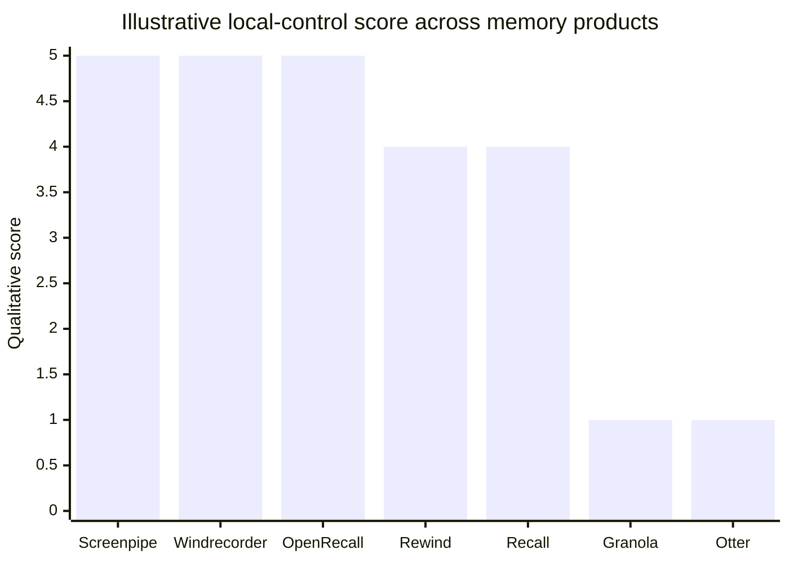
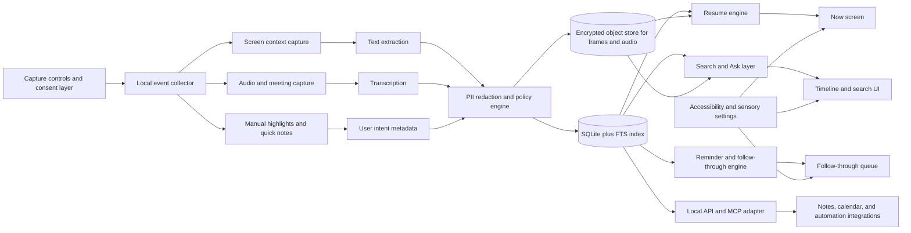
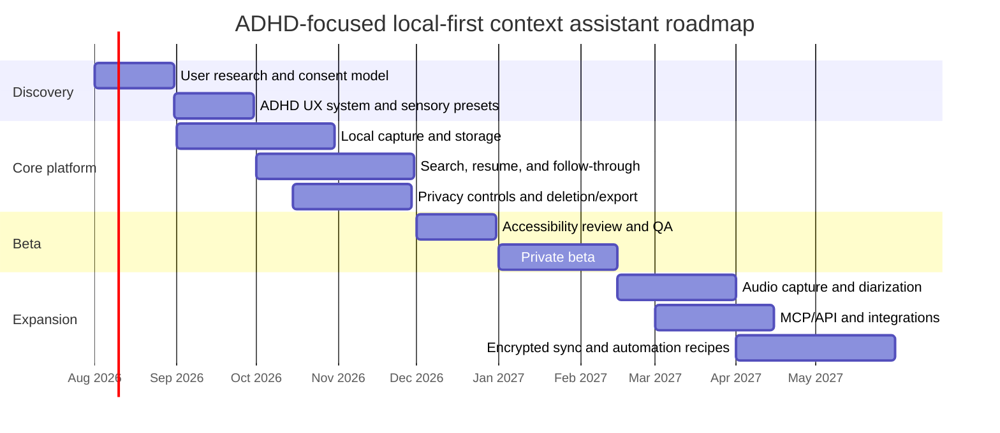

# Deep Research Report on Rewind, Screenpipe, and Neurodivergent-Centered Design for ADHD

## Executive summary

This report interprets **“Rrwind” as Rewind / Rewind.ai**, now effectively part of the **Limitless** product lineage, because current official materials refer to **Rewind for macOS**, describe how it interacts with Limitless subscriptions, and state that **the Rewind app is sunsetting**, with capture disabled beginning **December 19, 2025**. The same official help materials also say that **Limitless itself does not currently support screen recording**, although the company plans to bring favored Rewind features into Limitless later. citeturn14search0turn9view2turn12search1

The market has now split into **four distinct product families**. First are **passive memory systems** that continuously capture screen or audio context and make it searchable, such as Screenpipe, Rewind/Limitless, Microsoft Recall, Windrecorder, and OpenRecall. Second are **meeting and voice capture systems** such as Granola, Otter, Read AI, Google Meet’s “Take notes for me,” and PLAUD. Third are **attention-shaping or distraction-friction tools** such as Freedom, one sec, Opal, ScreenZen, Cold Turkey, RescueTime, and Rize. Fourth are **workflow simplifiers and context managers** such as Workona, Toby, Raycast, Mem, Morgen, n8n, and Zapier. What is still missing is a product that combines **local-first memory**, **ADHD-aware state management**, **sensory-safe UX**, and **strong user control over capture and reminders** in one coherent system. citeturn6view0turn9view2turn33search2turn23search0turn23search2turn17search1turn17search10turn27search4turn27search5turn17search3turn18search0turn18search4turn19search0turn25search0turn20search0turn21search0turn22search0turn21search22turn21search19turn24search2turn26search1turn27search11turn24search0turn24search1

For ADHD-focused design, the strongest evidence points to several product implications. ADHD is closely associated with **working-memory and executive-function difficulties**, while adult ADHD research also shows problems with **time perception**, **prospective memory**, and **organization in time**. That means the winning product should not merely “store everything”; it should **externalize working memory**, surface **the next step at the right moment**, support **time anchoring**, and minimize the need for users to remember where something lives or how to resume after interruption. citeturn29search19turn29search7turn30search4turn30search33turn30search5turn30search6turn30search0

The design recommendation that emerges is a **local-first personal context system with ADHD scaffolding**, not a generic surveillance-style recorder. The product should prioritize: **selective local capture**, **manual and scheduled focus modes**, **memory search that returns exact moments and next actions**, **gentle but configurable reminders**, **progressive disclosure instead of dashboard overload**, **reduced-motion and reduced-alert modes**, and **privacy-by-design defaults** including visible recording state, short retention options, purpose-bound data collection, and strong deletion/export control. WCAG 2.2 and W3C’s cognitive accessibility guidance also strongly support accessible authentication, reduced redundant entry, consistent help, and designs that lower recall burden. citeturn31search1turn31search12turn31search26turn31search19turn31search22turn31search28turn34search1turn34search7turn34search19

A realistic build plan is to target an **MVP in roughly 5–7 months** and a stronger **v1 in 9–14 months**, assuming a normal modern product team rather than extreme staffing constraints. The fastest technical route is a **Tauri desktop shell**, local storage via **SQLite FTS5**, local transcription with **whisper.cpp**, OCR with **Tesseract** as fallback, and a local API / MCP layer for integration. That architecture is strongly aligned with Screenpipe’s proven shape, while allowing the UX and prioritization model to differ meaningfully for ADHD users. citeturn35search8turn35search2turn35search1turn35search7turn6view0

## Product profiles

**Rewind / Limitless lineage**

**Purpose.** Rewind’s original product proposition was a memory layer for personal computing: continuously capture context, then let the user “rewind” their past activity. The current official Limitless help center still preserves this positioning indirectly: it says users can “continue to record your screen with Rewind for macOS,” while Limitless itself plans to bring Rewind-style screen recording forward into the newer platform. The current Limitless stack is broader than Rewind: web, desktop, mobile, and the Pendant wearable focus on conversations, lifelogs, summaries, and Ask AI rather than only desktop screen memory. citeturn9view2turn12search0turn11view1turn11view3turn16search0

**Current status and deployment.** Official Limitless materials now say the Rewind app is sunsetting and that the latest update disables screen and audio capture from **December 19, 2025**. Rewind remained available for **macOS** in the transition period, and Limitless subscriptions in 2025 included **Rewind Pro**. By contrast, current Limitless products run across **web, Mac, Windows, iOS, Android**, with Pendant pairing through mobile and viewing/search through web and desktop apps. citeturn14search0turn9view2turn12search0turn12search2turn11view3turn12search3

**Features and UX flow.** For the legacy desktop side, the official materials confirm screen recording for Rewind on macOS, local data accessible under `~/Library/Application Support/com.memoryvault.MemoryVault`, a “Delete all data” action in Rewind settings, and no supported API. For the current Limitless experience, onboarding is: install app, onboard, start capture, see the first lifelog appear, mark important moments, then search, Ask AI, share summaries, label speakers, and add custom vocabulary. This is a useful signal for a future ADHD-focused design: the best experience is not only search, but a loop of **capture → highlight → retrieve → act**. citeturn9view4turn8search6turn11view3turn16search0

**Architecture and tech stack.** The Rewind app’s internal stack is largely opaque in current official materials because it is proprietary and sunsetting. What can be confirmed is a macOS desktop app that requested **microphone** and **screen recording/system audio** permissions, stored data locally in the `com.memoryvault.MemoryVault` application support path, and had no public supported API. The current Limitless platform adds a cloud API, MCP endpoint, mobile apps, and a Pendant-centric data pipeline; the official developer platform currently says the API is **beta** and, at this time, **supports Pendant data only**. citeturn9view3turn9view4turn16search0

**Licensing, extensibility, and integrations.** Rewind is proprietary; no source repository or open license is published in current official materials. Extensibility on the Rewind side is weak by current standards because official docs say there is **no supported API**. The current Limitless platform is more extensible: it exposes a developer API, lifelog/chat endpoints, API keys, and an **MCP integration** endpoint for compatible clients such as Claude and similar tools. That means the lineage has moved from closed local app toward a proprietary cloud-plus-device platform with partial developer access. citeturn9view4turn16search0

**Accessibility.** Public official materials do not expose a VPAT or formal accessibility conformance statement for Rewind or Limitless in the sources reviewed here. Operationally, the current flow depends on mobile apps, desktop/web apps, and permissions dialogs. For an ADHD-focused design, that absence matters: the lineage is strong in capture and recall, but weakly documented in cognitive accessibility commitments. citeturn11view3turn12search3

**Privacy and security.** This is where the Rewind/Limitless lineage changed the most. The legacy app appears to have been comparatively local, based on official local-storage paths and local deletion controls. The current Limitless platform, however, is not purely local-first: official docs say data is encrypted at rest and in transit, optional meeting “Lockdown” enables end-to-end encryption for specific meetings, and locked-down data cannot be searched or used for AI responses. At the same time, the company’s privacy-facing Pendant materials say audio, transcripts, and summaries may be used to improve services and third-party models, and may be disclosed to vendors and service providers helping deliver the service. For an ADHD-focused user base, that mixed model is strategically important: it is attractive for convenience, but materially weaker than a strict local-first trust posture. citeturn11view0turn11view1turn10search7

**Pricing.** Official pricing materials indicate a **free plan** with **1,200 minutes per month** for current Limitless usage, plus paid **Pro** and **Unlimited** plans. In 2025, Rewind Pro was bundled with Limitless Pro and Unlimited. Official product marketing also shows the Pendant sold as a hardware bundle at one point with a one-year Unlimited plan. citeturn12search0turn12search2turn13search1

**Bottom line.** Rewind was influential, but as a current design reference it is now best treated as a **legacy, partly-local memory product whose future lives inside a more cloud-mediated Limitless platform**. That makes it inspirational for “memory” but less ideal as the direct template for a privacy-maximal ADHD tool. citeturn14search0turn9view2turn16search0

**Screenpipe**

**Purpose.** Screenpipe positions itself as a continuously running **screen and audio memory infrastructure** that is **local, private, and secure**, geared not only to retrieval but to **agents, automations, and integrations**. Its official repo describes it as continuously capturing screen and audio into a searchable AI-powered memory of everything done on the computer. citeturn32search4turn6view0

**Features.** Official materials and the GitHub README confirm: event-driven screen capture, accessibility-tree text extraction with OCR fallback, local or cloud transcription, full-text search, timeline/history, a localhost REST API, an MCP server, a JavaScript/TypeScript SDK, a plugin model called **Pipes**, optional encrypted sync, per-pipe AI data permissions, and team deployment features. Integrations include Cursor, Claude Code, Cline, Continue, OpenCode, Gemini CLI, ChatGPT via MCP, Claude Desktop, Obsidian, Notion, and local AI backends such as Ollama. citeturn6view0turn6view1turn3view0

**Architecture and tech stack.** Screenpipe’s official architecture is unusually explicit. The capture layer listens for OS events such as app switches, clicks, typing pauses, scrolls, and clipboard activity, then records screenshots and accessibility trees on meaningful changes. It uses **Whisper** locally or **Deepgram** in the cloud for speech-to-text, stores text in **SQLite with FTS5**, saves screenshots as JPEGs, exposes a **REST API on localhost:3030**, and renders the desktop UI with **Tauri**, using **Rust + TypeScript**. This stack is directly relevant to a specialized ADHD product, because it proves a feasible local-first technical baseline that does not require full-motion video recording. citeturn6view0turn6view1turn35search8turn35search2

**Licensing.** Screenpipe is **source-available**, not standard open source in the commercial sense. The official README says personal non-commercial use of the source is permitted, while the signed desktop app is subscription-based and commercial use of the source requires a license. That difference matters for build strategy: Screenpipe is highly useful as a reference architecture, but not a costless commercial dependency. citeturn6view0turn6view1

**Deployment.** Screenpipe runs on **macOS, Windows, and Linux**. It also supports **team deployment**, admin-managed capture rules, MDM readiness, SSO/SAML, and central configuration for enterprise scenarios. citeturn6view0turn6view1

**UX flow.** The dominant flow is: install, grant permissions, run in the background, accumulate event-driven screen and audio history, search or scrub timeline later, or let AI clients query that history through MCP/API. Its “Pipe” model extends the experience from passive recall to scheduled or agentic workflows. Compared with Rewind, Screenpipe is much more explicitly built as **memory infrastructure plus developer platform** rather than purely a polished personal memory app. citeturn6view0turn6view1

**Accessibility.** Screenpipe’s repo documents heavy use of the OS accessibility tree for capture accuracy, which is important technically because it often yields higher-quality structure than OCR. However, the reviewed sources do not surface a formal end-user accessibility conformance statement for the Screenpipe UI itself. So Screenpipe demonstrates strong **accessibility-data extraction**, but not necessarily a fully documented **accessible interface strategy**. citeturn6view1

**Privacy and security.** Screenpipe is notably strong here. Official materials say that by default all data is local, stored in a local SQLite database, with no account required, and nothing sent to external servers unless the user enables cloud transcription, hosted AI, or cloud sync. The same materials also disclose that telemetry is enabled through PostHog by default and Sentry receives crash/error diagnostics while telemetry is on. In other words, its privacy story is unusually strong but not magical: the local-mode path is excellent, yet users still need explicit privacy settings and clear defaults. The official site also highlights encrypted-at-rest storage, user-owned keys, and on-device PII redaction. citeturn6view0turn6view1turn32search0turn32search6

**Pricing.** Official pricing states that the source is available for personal non-commercial use, while the signed app has subscriptions: **Standard $25/month**, **Pro $50/seat/month**, and **Enterprise $150/seat/month**. Existing lifetime licenses remain valid, but new lifetime purchases are no longer sold. citeturn6view0turn6view1

**Bottom line.** Screenpipe is the stronger direct design reference if the goal is to build a specialized neurodivergent product: it already proves **local-first capture**, **programmable automation**, **cross-platform deployment**, and **permission-scoped AI access**. Its main weakness, for this use case, is that it is optimized for technical power and agent workflows, not for **low-cognitive-load, sensory-safe, ADHD-first everyday use**. citeturn6view0turn6view1

## Competitive landscape

The competitive field is broad, but it becomes more tractable when grouped by the user problem each product actually solves. **Passive memory tools** solve “what was I doing before I got interrupted?” **Meeting capture tools** solve “what happened in this conversation?” **Focus/friction apps** solve “how do I stop reflexively opening distractions?” **Workflow simplifiers** solve “how do I reduce context switching and clutter?” An ADHD-focused product should borrow selectively from all four categories rather than compete head-on with only one. citeturn33search2turn27search4turn18search0turn21search22

The chart above is a synthesis, not a vendor metric. It reflects how strongly each product emphasizes **local storage, local processing, local search, and user-side control**, based on official materials reviewed in this report. Screenpipe, Windrecorder, and OpenRecall cluster at the local-first end; Rewind historically sat closer to that end but is now part of a more cloud-shaped Limitless ecosystem; Recall is local but platform-restricted; meeting copilots like Granola and Otter are much weaker on local control because their core value is delivered through proprietary managed services. citeturn6view0turn23search0turn23search2turn9view4turn33search0turn17search1turn17search10

| Name | URL | Core features | Target users | Platform | License / pricing | Strengths | Weaknesses |
|---|---|---|---|---|---|---|---|
| Screenpipe | [screenpipe.com](https://screenpipe.com/) / [GitHub](https://github.com/screenpipe/screenpipe) | Event-driven screen + audio capture, local search, REST API, MCP, Pipes, local AI options | Power users, AI developers, teams | macOS, Windows, Linux | Source-available; signed app from $25/mo | Best-in-class extensibility and local-first posture | More infrastructure-like than calming consumer UX; signed app is paid citeturn6view0turn6view1turn32search0 |
| Rewind / Limitless | [limitless.ai](https://www.limitless.ai/) | Legacy Rewind screen capture for macOS; current Limitless lifelogs, Ask AI, summaries, pendant | Professionals wanting searchable memory and conversation recall | Rewind: macOS; Limitless: web, Mac, Windows, iOS, Android | Proprietary; free tier plus Pro / Unlimited | Strong “personal memory” framing and polished capture-to-summary flow | Rewind is sunsetting; current platform is less purely local and Rewind has no supported API citeturn14search0turn9view2turn12search0turn16search0 |
| Microsoft Recall | [Microsoft support](https://support.microsoft.com/en-us/windows/ai/ai-features/retrace-your-steps-with-recall) | Snapshot-based desktop recall, local encrypted storage, filtering and search | Windows Copilot+ users | Windows Copilot+ PCs only | Proprietary; bundled with supported devices | Deep OS integration and local processing | Hardware-gated, privacy-sensitive category, limited portability and ecosystem openness citeturn33search0turn33search2turn33search4turn33search6 |
| Windrecorder | [GitHub](https://github.com/yuka-friends/Windrecorder) | Local screen memory, OCR/image description search, activity stats | Privacy-conscious Windows users | Windows | GPL-2.0 | Strong local-first/open-source value | Narrower polish and ecosystem than commercial tools citeturn23search0 |
| OpenRecall | [openrecall.github.io](https://openrecall.github.io/) / [GitHub](https://github.com/openrecall/openrecall) | Local screenshot capture, OCR, semantic search, privacy-first recall | Self-hosters and privacy-first tinkerers | Windows, macOS, self-hosted patterns | Open source | Transparent and privacy-forward alternative to Recall/Rewind | Less mature productization and fewer ready-made UX affordances citeturn23search2turn23search10turn23search13 |
| OpenRewind | [GitHub](https://github.com/alikia2x/openrewind) | Privacy-first open-source Rewind alternative, digital history access | Open-source experimenters | Not fully standardized in public docs | GPL-3.0 | Clear intent as a Rewind alternative | Small project footprint and limited product maturity citeturn23search1 |
| Granola | [granola.ai](https://www.granola.ai/) | Bot-free AI meeting notes, summaries, highlights, mobile support | People in back-to-back meetings | macOS, iPhone | Proprietary; free tier then paid history/features | Very polished meeting-note experience | Not a general local memory system; storage/control posture is weaker than local-first tools citeturn17search1turn17search5 |
| Otter.ai | [otter.ai](https://otter.ai/) | Real-time transcription, meeting agent, summaries, integrations | Individuals and teams in frequent meetings | Web, Mac, Windows, mobile | Proprietary; free and paid tiers | Mature transcription + meeting workflow ecosystem | Cloud-centric and meeting-first rather than local memory or ADHD scaffolding citeturn17search10turn17search2 |
| Read AI | [read.ai](https://www.read.ai/) | AI notes, transcripts, playback, messaging/email summaries, coaching | Teams already living in meetings and collaboration suites | Web, Mac, Windows, iOS, Android | Proprietary; free and paid tiers | Strong cross-channel summarization | Heavier team/copilot posture than personal memory UX citeturn27search4turn27search0turn27search12 |
| Google Meet Take notes for me | [Google support](https://support.google.com/meet/answer/14754931?hl=en) | Auto notes, summaries, action items into Google Docs/Calendar | Workspace and Google AI subscribers | Web, Android, meeting contexts | Proprietary; tied to eligible Workspace/AI plans | Frictionless inside Google ecosystem | Not a standalone memory product; vendor lock-in and cloud dependency citeturn27search1turn27search5turn27search13turn27search9 |
| PLAUD ecosystem | [plaud.ai](https://jp.plaud.ai/) | Wearable/card recorders, app/web/desktop, AI transcription, summaries, Ask Plaud, AutoFlow | Professionals capturing calls, meetings, ideas | Hardware + mobile/web/desktop | Proprietary; device purchase plus plan tiers | Strong cross-context voice capture and hardware options | Less suited to silent screen-memory recall; dependent on proprietary stack citeturn17search3turn17search11 |
| Freedom | [freedom.to](https://freedom.to/) | Cross-device website/app/internet blocking, scheduled sessions | People needing strong distraction blocking | Mac, Windows, iOS, Android, Chrome | Proprietary subscription | Broad cross-platform blocking and synchronization | Not a memory tool; little contextual retrieval or ADHD-specific state support citeturn18search0 |
| one sec | [one-sec.app](https://one-sec.app/) | Delay, breathing prompt, blocking, habit interruption, browser extension | Users fighting reflexive app opening | iOS, Android, browser, desktop extension context | Freemium / paid upgrades | Excellent “add friction before impulse” design | Narrow problem scope; weak memory and workflow support citeturn18search4turn18search1turn18search8 |
| Opal | [opal.so](https://www.opal.so/) | Screen time control, blocking rules, timers, rewards/history | People trying to reclaim focus time | iPhone, Mac, Android | Free + Pro subscription / lifetime options | Polished focus UX and strong scheduling | Gamified approach can add stimulation; not local memory infrastructure citeturn19search0turn19search2turn19search18 |
| ScreenZen | [screenzen.co](https://screenzen.co/) | Delay opening, interrupt scrolling, app goals, blocking, Halo geofence device | Adults seeking low-cost anti-scroll friction | iOS, macOS, Windows, Android | Free / donation-supported; Halo hardware extra | Very good value and excellent friction patterns | Narrower analytics and automation than premium suites citeturn24search3turn24search7turn25search0 |
| Cold Turkey | [getcoldturkey.com](https://getcoldturkey.com/) | Hard-to-bypass site/app/internet blocking, schedules, locks, allowances | Students and workers needing “difficult to bypass” blocking | Desktop-focused | Free + Pro | Exceptional enforcement strength | Less gentle and less adaptive; no memory/search layer citeturn20search0turn20search13 |
| RescueTime | [rescuetime.com](https://www.rescuetime.com/) | Automatic time tracking, blocking, insights, projects, team dashboards | Knowledge workers and managers | Desktop, mobile | Free + paid tiers | Strong passive time-tracking and reporting | Retrospective analytics do not solve interruption recovery by themselves citeturn21search0turn21search4turn21search16 |
| Rize | [rize.io](https://rize.io/) | Automatic time tracking, productivity coach, distraction nudges, focus metrics | Professionals wanting coaching + tracked work patterns | Desktop, Windows app store listing | Proprietary | Better real-time focus coaching than plain trackers | Less privacy-local emphasis than a local-first memory stack; not a full recall system citeturn22search0turn22search14turn22search18 |
| Workona | [workona.com](https://workona.com/) | Browser workspaces, context switching, tab/session organization | Browser-heavy project workers | Browser / extension context | Free + paid tiers | Excellent context partitioning and tab sanity | No passive memory capture; mostly browser-centric citeturn21search22turn21search6 |
| Toby | [gettoby.com](https://www.gettoby.com/) | Visual workspace for browser tabs/links, AI naming/sorting, sync | People drowning in tabs | Browser / Chrome / Edge | Free + paid tiers | Good visual decluttering of tab overload | Cloud/account dependence and limited benefit outside browser work citeturn21search19turn21search3turn21search7 |
| Raycast | [raycast.com](https://www.raycast.com/) | Launcher, commands, extensions, AI utilities, workflow shortcuts | Keyboard-centric Mac/Windows productivity users | Mac, Windows beta | Free + paid plans | Strong modular simplification and shortcut surface | Not a memory recorder; more of a fast command hub than recall system citeturn24search2 |
| Mem | [get.mem.ai](https://get.mem.ai/) | Connected notes, meetings, agent check-ins, voice mode, clipper | Solo professionals and knowledge workers | Web-first workspace | Free + Pro | Good “agent remembers what matters” framing | Primarily note/workspace centric, not passive life-log capture citeturn26search1turn26search16 |
| Morgen | [morgen.so](https://www.morgen.so/) | Unified calendars + tasks, AI daily planning, deadline visibility | People needing calmer planning across tools | Desktop / calendar ecosystem | Paid, with trial | Strong time anchoring and schedule perspective | Not a passive capture product; high price can limit diffusion citeturn27search11turn27search3 |
| n8n | [n8n.io](https://n8n.io/) | Workflow automation, low-code integrations, self-hosting | Builders and teams automating processes | Cloud or self-hosted | Open-core / cloud pricing | Useful back-end automation layer for reminders and integrations | Requires composition with another UX product; not end-user memory software citeturn24search0 |
| Zapier | [zapier.com](https://zapier.com/) | No-code automation across 9,000+ apps, AI workflows, tables/forms | Broad business automation users | Cloud | Free + paid tiers | Huge integration footprint | Cloud-first and expensive at scale; not a memory UX by itself citeturn24search1turn24search5turn24search17 |

The clearest market gap sits between these categories. Local-memory products are strong at **capture and search**. Focus apps are strong at **interrupting impulsive behavior**. Planning tools are strong at **time anchoring**. But few products combine **interruption recovery**, **memory search**, **adaptive reminder timing**, **sensory-safe defaults**, and **user-controlled privacy** in one unified experience. That is the main opportunity area. citeturn6view0turn18search4turn27search11turn34search1

## ADHD and neurodivergent-specific requirements

ADHD design should start from **cognitive reality**, not from a generic productivity mindset. Research reviews show that ADHD is strongly associated with **executive-function** and **working-memory** impairments, and this is not a minor edge case: central executive working-memory deficits are a robust finding, while broader reviews note impairments across attention and executive domains in both children and adults. For product design, that means the interface should assume that users may **lose state mid-task**, forget intentions rapidly, and struggle to reconstruct context after interruption. citeturn29search19turn29search7turn30search12

A second major implication is **time blindness / weak time anchoring**. Reviews of adult ADHD time perception report substantial differences in time perception, and recent studies show poorer **organization-in-time ability** among adults with ADHD. This is a strong argument for visible time horizons, countdowns, “what was I doing before this?” affordances, and reminder systems that respect not just deadlines but **attention transitions**. In other words, the product should help the user locate themselves in time, not just in information. citeturn30search4turn30search33turn30search0

A third major implication concerns **prospective memory**. Studies in adults with ADHD report deficits in complex prospective memory, especially when planning demands are high, and naturalistic assessment work similarly points to difficulty remembering intended future actions while doing other things. This makes a strong design case for turning captured context into **structured external memory**: deferred reminders, follow-up prompts, “resume packs,” and action extraction should be treated as core product value, not secondary nice-to-haves. citeturn30search5turn30search6turn30search13

At the same time, the evidence also argues against a one-size-fits-all ADHD stereotype. Reviews emphasize **heterogeneity** in executive-function profiles; not every person with ADHD has the same impairments or the same severity. Therefore, a specialized product should be highly customizable: some users need strong friction before distractions, some need low-friction capture, some need aggressive reminders, and some will find those reminders overwhelming. Personalization is not polish here; it is central accessibility work. citeturn29search7turn30search9

For cognitive accessibility more broadly, W3C guidance is directly applicable. W3C’s cognitive accessibility work and “Making Content Usable for People with Cognitive and Learning Disabilities” emphasize reducing memory load, avoiding unnecessary complexity, and providing design patterns that make tasks understandable and recoverable. WCAG 2.2 specifically adds **Accessible Authentication**, warns against logins that depend on memorization or copying codes, and also adds **Redundant Entry** protections. For ADHD users, these are not peripheral standards; they remove exactly the kinds of fragile steps that tend to fail under distraction or fatigue. citeturn31search0turn31search19turn31search22turn31search1turn31search12turn31search26

Sensory considerations matter as well, even though the strongest literature here is often broader neurodivergence rather than ADHD-only. Reputable autism guidance notes that neurodivergent users may be more or less sensitive to **sounds, lights, textures, and overall sensory load**. In product terms, that supports giving users control over motion, sound, visual density, celebratory effects, and notification intensity. The safest default for a tool aimed at ADHD users is not “engaging” but **calm, consistent, and easy to tune**. citeturn31search11turn28search6

Finally, privacy is not just legal hygiene in this category; it is a usability requirement. A system that records screens, voices, or behavioral patterns creates unusually sensitive data, and official privacy guidance is clear that data protection should be built in from the design phase, with data minimization and lifecycle controls. For a neurodivergent audience, this is magnified because the tool may reveal medication routines, mental-health patterns, impulse behavior, academic struggles, or workplace friction. If the product feels creepy, people will not trust it enough to rely on it. citeturn34search1turn34search7turn34search19turn34search0

## Design and technical recommendations

The strongest product concept is a **local-first personal context assistant for interruption recovery and follow-through**. It should not imitate every capability of Screenpipe or Limitless. Instead, it should specialize around the ADHD pain loop: **start task → get interrupted → forget context → lose time reorienting → miss follow-up → feel overwhelmed**. The product’s job is to shorten that loop and reduce its emotional cost. This is why a specialized design should prioritize **resumption, externalized memory, and controlled friction** over maximal capture breadth. citeturn29search19turn30search5turn30search0turn6view0

**Recommended feature prioritization**

| Tier | Recommended capabilities | Why this matters for ADHD users |
|---|---|---|
| MVP | Local screen/app context capture with clear on/off controls; manual highlight button; “resume my last task” command; searchable timeline; action-item extraction; reminder scheduling; low-stimulation focus mode; export/delete; short retention presets; simple note/calendar integration | Directly addresses working-memory loss, interruption recovery, and follow-through without requiring the user to “be organized” first citeturn29search19turn30search5turn30search0turn31search19 |
| Advanced | Audio transcription and diarization; adaptive reminder timing; app/site friction rules; wearable/audio capture; MCP/API; encrypted sync; automation recipes; team-safe consent modes; on-device PII redaction | Extends from memory aid into a full context platform, but only after the core resumption loop is stable and trusted citeturn6view0turn32search6turn16search0turn18search4 |

**Recommended UX patterns**

The UX should revolve around **three home states**, not a giant dashboard. The first is **Now**, which shows the single most likely current task, time anchor, and any active focus rule. The second is **Resume**, which reconstructs the last unfinished context using recent windows, notes, browser pages, and highlights. The third is **Follow through**, which surfaces reminders and action items in a short, human-readable queue. This is preferable to a dense analytics surface because ADHD-friendly design should reduce reconstruction effort and choice overload. That direction is also consistent with W3C’s cognitive guidance to reduce memory burden and complexity. citeturn31search19turn31search28turn29search7

The right notification model is **gentle, situational, and defeatable**. The product should support: quiet reminders, escalating reminders only when explicitly enabled, “snooze with context,” and “ask me when I leave this app” or “ask me after this meeting” triggers. one sec and ScreenZen demonstrate that a small delay before opening a distracting app can change behavior materially; for an ADHD-specific product, that idea should be integrated with captured context, so friction is not abstract punishment but a chance to recall the user’s own stated intention. citeturn18search4turn24search3turn24search7

The authentication and onboarding design should be unusually forgiving. Use passkeys or password-manager-friendly login, avoid CAPTCHA-like cognitive tests where possible, keep onboarding to a few reversible choices, and allow users to begin with **manual highlights only** before enabling passive capture. This respects both WCAG 2.2’s accessible authentication direction and the reality that trust and overwhelm are major adoption blockers in this category. citeturn31search1turn31search12turn31search22

**Reference architecture**

This architecture keeps the **privacy boundary local by default**, which is the safest posture for this category. It also separates **capture**, **policy**, **storage**, and **user-facing assistance**, which makes it easier to offer different privacy modes. For example, some users may want screen context only, some manual highlights only, and some full screen-plus-audio capture. Screenpipe’s architecture is a strong precedent for event-driven capture, local FTS indexing, and a local API, while Tauri, SQLite FTS5, whisper.cpp, and Tesseract are practical building blocks for a cross-platform local-first stack. citeturn6view0turn6view1turn35search8turn35search2turn35search1turn35search7

**Data model**

A specialized product should treat captured data as **assistive state**, not just media. The core entities should include: `CaptureEvent`, `Session`, `Artifact`, `TranscriptSpan`, `TaskCandidate`, `Reminder`, `Highlight`, `PreferenceProfile`, `ConsentRecord`, `FrictionRule`, and `AttentionState`. The most important design choice is to keep **user intent** first-class. For ADHD users, “why did I open this?” and “what was I trying to finish?” are often more useful than the raw screenshot itself. This is where a generic recall tool and an ADHD-specialized tool diverge most sharply. citeturn30search5turn30search0turn31search19

**Privacy-by-design recommendations**

The default should be **manual-first onboarding**, **local-only capture**, **30-day retention or shorter**, **visible recording state**, and **one-click pause**. Add purpose-specific toggles such as “study mode,” “meeting mode,” and “private mode,” and make the data model support delete/export by time slice and category. Purpose limitation and data minimization should drive storage design from the start, not be retrofitted later. For especially sensitive use cases, offer “locked” sessions whose content is encrypted and excluded from AI processing and search, analogous in spirit to Limitless’s meeting Lockdown but implemented locally. citeturn34search1turn34search7turn34search19turn11view0

**Suggested integrations**

The first integrations should be **calendar**, **notes/PKM**, **task manager**, and **browser**. These are the highest-yield because they reduce resumption friction and follow-through gaps. A second wave should include **MCP / local API**, so AI clients can answer bounded questions over the user’s own context. n8n and Zapier are good downstream automation targets, but they should be optional adapters behind explicit user authorization rather than core architecture. citeturn16search0turn24search0turn24search1turn6view0

**Metrics to track**

The most meaningful product metrics are not raw capture volume. Track **time-to-resume after interruption**, **successful refind rate**, **action-item completion rate**, **reminder acceptance vs dismissal**, **notification regret rate**, **weekly self-reported overwhelm**, **pause/delete/export usage**, and **battery/CPU/disk cost**. For this product, a feature that increases “engagement” but also increases overwhelm is not necessarily a success. That is a crucial difference from mainstream productivity tooling. The recommendation here is an inference from ADHD cognitive research plus the affordances visible in memory and focus products reviewed above. citeturn29search19turn30search0turn18search4turn21search0

**Primary risks**

The biggest risks are **overcapture**, **surveillance interpretation**, **notification fatigue**, **AI hallucination over memory data**, **cross-user consent problems**, and **sensory overload disguised as motivation**. The specialized product should therefore reject dark patterns such as streaks, leaderboards, or heavy gamification by default, especially when the user has asked for a calm environment. Freedom’s anti-dopamine design language is actually closer to the right principle than engagement-heavy productivity apps. citeturn18search0turn19search1turn11view1turn34search1

## Roadmap and estimated effort

A reasonable delivery plan is to separate **assistive value** from **platform ambition**. Many products in this category overbuild capture and underbuild trust and resumption UX. The fastest route to differentiation is therefore to ship a narrow but excellent **interruption recovery MVP**, then add heavier automation, sync, and richer capture later. That sequencing is also consistent with the complexity visible in Screenpipe’s architecture and the feature breadth of platforms like Limitless and Recall. citeturn6view0turn16search0turn33search2

| Milestone | Core output | Indicative effort | Indicative elapsed time |
|---|---|---:|---:|
| Research, consent model, ADHD design validation | User journeys, privacy model, sensory presets, success metrics | 3–5 person-months | 4–6 weeks |
| Local capture prototype | Screen/app context capture, local index, pause/delete/export | 5–8 person-months | 6–10 weeks |
| ADHD-first UX shell | Now / Resume / Follow-through UI, low-stimulation theming, friction rules | 4–7 person-months | 6–8 weeks |
| MVP intelligence layer | Search, highlights, action extraction, reminders, basic calendar/notes integration | 6–9 person-months | 6–10 weeks |
| Beta hardening | Performance, retention policies, edge cases, accessibility review, QA | 4–6 person-months | 4–6 weeks |
| Advanced platform features | Audio, diarization, encrypted sync, MCP/API, automation recipes | 10–18 person-months | 8–16 weeks |

That translates to an **MVP in roughly 20–35 person-months**, typically **5–7 calendar months**, and a more fully featured **v1 in roughly 40–65 person-months**, often **9–14 calendar months**. These are synthesis-based estimates derived from the breadth and complexity shown in the compared product patterns, not vendor disclosures. citeturn6view0turn16search0turn24search0turn24search1

**Suggested open-source building blocks**

The most pragmatic stack would be **Tauri** for the desktop shell, **SQLite FTS5** for on-device search, **whisper.cpp** for local transcription, and **Tesseract** as OCR fallback. Tauri is attractive because it supports major desktop and mobile targets while allowing a Rust back end; SQLite FTS5 gives a well-understood local full-text index; whisper.cpp is a practical local ASR option; and Tesseract remains a standard open-source OCR engine. citeturn35search8turn35search2turn35search1turn35search7

## Prioritized references

| Priority | Reference | Why it matters |
|---|---|---|
| High | [Screenpipe GitHub README](https://github.com/screenpipe/screenpipe) | Best primary source for Screenpipe features, architecture, pricing, privacy defaults, integrations, and API/MCP model. citeturn6view0turn6view1 |
| High | [Screenpipe official site](https://screenpipe.com/) | Official positioning, security/compliance messaging, and privacy posture. citeturn32search0turn32search6 |
| High | [Limitless Help Center: Screen Recording](https://help.limitless.ai/en/articles/9135527-screen-recording) | Confirms current Rewind/Limitless transition and that Limitless currently lacks screen recording. citeturn9view2 |
| High | [Limitless Help Center: Where can I find my Rewind data?](https://help.limitless.ai/en/articles/13048802-where-can-i-find-my-rewind-data) | Rare primary evidence about Rewind local storage and lack of supported API. citeturn9view4 |
| High | [Limitless Developer Platform](https://www.limitless.ai/developers) | Confirms current API and MCP direction for the Limitless ecosystem. citeturn16search0 |
| High | [Microsoft Recall official support pages](https://support.microsoft.com/en-us/windows/ai/ai-features/retrace-your-steps-with-recall) | Primary source for Recall’s opt-in model, local encrypted storage, system requirements, and privacy controls. citeturn33search0turn33search2turn33search4turn33search6 |
| High | [W3C Cognitive Accessibility at W3C](https://www.w3.org/WAI/cognitive/) and [Making Content Usable](https://www.w3.org/TR/coga-usable/) | Strongest standards-oriented accessibility guidance for lowering cognitive burden. citeturn31search0turn31search19 |
| High | [WCAG 2.2 Accessible Authentication](https://www.w3.org/WAI/WCAG22/Understanding/accessible-authentication-minimum.html) and [What’s New in WCAG 2.2](https://www.w3.org/WAI/standards-guidelines/wcag/new-in-22/) | Directly relevant for login, onboarding, error tolerance, and reducing recall load. citeturn31search1turn31search12turn31search26 |
| High | [Kofler et al. on working memory in ADHD](https://pmc.ncbi.nlm.nih.gov/articles/PMC7483636/) | Key research basis for designing around externalized memory rather than relying on user recall. citeturn29search19 |
| High | [Review of executive function deficits in ADHD](https://pmc.ncbi.nlm.nih.gov/articles/PMC11485171/) | Good synthesis of executive-function heterogeneity and impairment patterns. citeturn29search7 |
| High | [Time Perception in Adult ADHD](https://pmc.ncbi.nlm.nih.gov/articles/PMC9962130/) and [Time perception as focal symptom review](https://pmc.ncbi.nlm.nih.gov/articles/PMC8293837/) | Strong evidence for time anchoring, reminder timing, and interruption recovery design. citeturn30search4turn30search33 |
| Medium | [NIST Privacy Framework](https://www.nist.gov/privacy-framework) and [ICO data protection by design](https://ico.org.uk/for-organisations/uk-gdpr-guidance-and-resources/accountability-and-governance/guide-to-accountability-and-governance/data-protection-by-design-and-by-default/) | Best basis for privacy-by-design recommendations in a sensitive lifelogging product. citeturn34search0turn34search1 |
| Medium | [EU Commission on data minimisation](https://commission.europa.eu/law/law-topic/data-protection/rules-business-and-organisations/principles-gdpr/how-much-data-can-be-collected_en) and [ICO data minimisation](https://ico.org.uk/for-organisations/uk-gdpr-guidance-and-resources/data-protection-principles/a-guide-to-the-data-protection-principles/data-minimisation/) | Important for retention, scope control, and safe defaults. citeturn34search7turn34search19 |
| Medium | [Tauri](https://v2.tauri.app/), [SQLite FTS5](https://www.sqlite.org/fts5.html), [whisper.cpp](https://github.com/ggml-org/whisper.cpp), [Tesseract OCR](https://tesseract-ocr.github.io/tessdoc/) | Practical primary sources for the recommended local-first implementation stack. citeturn35search8turn35search2turn35search1turn35search7 |